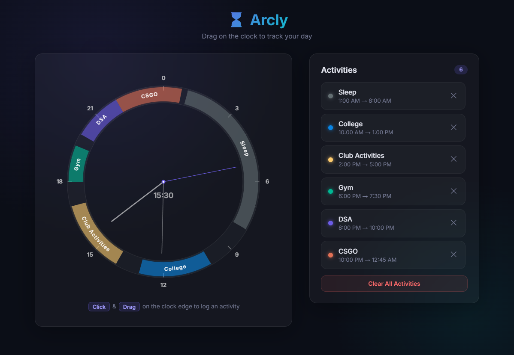
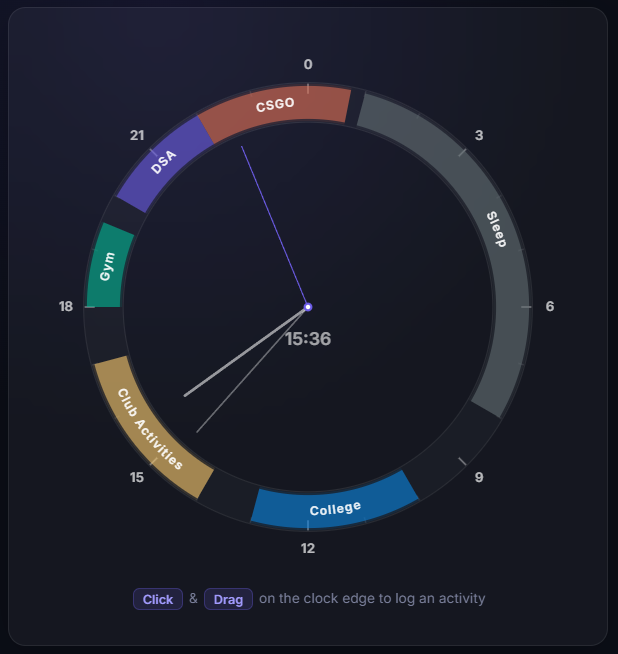

<div align="center">

# Arcly

**A visual time tracker built around a 24-hour clock face.**
Drag on the ring, log what you did, see your entire day at a glance.

**[Try it live](https://gyro-uyt.github.io/Arcly/)** | **[Report a bug](https://github.com/gyro-uyt/Arcly/issues)**

[](./LICENSE)
[](#)
[](#)

<br>



</div>

<br>

## Why this exists

Most time trackers are spreadsheets in disguise. You type in a task, hit start, hit stop, and at the end of the week you get a bar chart that tells you what you already knew — you spent too much time in meetings.

The problem isn't tracking. It's **seeing**.

A linear list of time entries doesn't communicate anything about the *shape* of your day. It doesn't show you that three-hour gap between deep work sessions. It doesn't make it viscerally obvious that you played games from 1 AM to 5 AM. A number in a cell is easy to ignore. A giant arc on a clock face is not.

Arcly is built on a simple premise: if you can see your day the same way you see a clock — as a continuous, circular whole — you'll understand your time differently. The 24-hour radial layout maps directly to how time actually works. Midnight is at the top. Noon is at the bottom. Your activities are colored arcs between them. No scrolling, no pagination, no "last 7 days" dropdown. Just today, all of it, in one ring.

The closest tools that do this are native iOS apps behind subscription paywalls. Arcly is a free, open-source web app that runs anywhere with a browser. No account required. No data leaves your machine.

---

## How it works

<table>
<tr>
<td width="50%">

**Drag to log** — Click and drag on the outer ring to select a time range. A modal appears where you name the activity and pick a category.

**Curved labels** — Text on each arc follows the ring's curvature, automatically flipping for readability on the bottom half.

**Color-coded categories** — Study (purple), Work (blue), Exercise (green), Play (orange), Rest (gray), Other (yellow).

**Persistent** — All data lives in your browser's localStorage. No accounts, no servers.

</td>
<td width="50%">



</td>
</tr>
</table>

---

## Project structure

```
Arcly/
├── index.html              # HTML shell (~65 lines)
├── css/
│   └── styles.css          # Dark theme, glassmorphism, responsive
├── js/
│   ├── app.js              # Entry point — wires modules, owns state
│   ├── constants.js        # Categories, clock geometry
│   ├── storage.js          # localStorage abstraction
│   ├── time-utils.js       # Angle/hour math, formatting
│   ├── clock-renderer.js   # Canvas: ring, arcs, hands, curved text
│   ├── drag-handler.js     # Mouse/touch drag-to-select
│   ├── modal.js            # Activity logging modal
│   └── activity-list.js    # Sidebar list rendering
├── assets/                 # Screenshots and media
├── .gitignore              # Standard ignore rules
├── LICENSE                 # MIT License
├── README.md               # Home base
└── IMPROVEMENTS.md         # Roadmap
```

No frameworks. No build step. No dependencies. Vanilla HTML, CSS, and ES modules served statically.

---

## Running locally

```bash
npx http-server . -p 8090
# Then open http://localhost:8090
```

> **Note:** ES modules require HTTP serving — `file://` won't work due to CORS restrictions on module imports.

---

## Under the hood

<details>
<summary><strong>Clock rendering</strong></summary>
<br>
Drawn on a single <code>&lt;canvas&gt;</code> using the 2D context API, redrawn every frame via <code>requestAnimationFrame</code>. The clock maps 24 hours to a full 360-degree rotation (15 degrees per hour). Activity arcs use <code>ctx.arc()</code> with a thick stroke. The animated second hand provides visual confirmation the render loop is alive.
</details>

<details>
<summary><strong>Curved text</strong></summary>
<br>
Rendered character-by-character along the arc path. Each glyph is individually positioned at the correct angle and rotated tangent to the circle. On the bottom half of the clock, the text direction reverses — characters are placed counter-clockwise with a 180-degree rotation offset — so labels always read left-to-right.
</details>

<details>
<summary><strong>Drag detection</strong></summary>
<br>
Uses <code>Math.atan2</code> to convert pointer coordinates to angles relative to the clock center. A distance check ensures drags only register on the ring band itself. Time values snap to 15-minute intervals for clean boundaries.
</details>

<details>
<summary><strong>State management</strong></summary>
<br>
A single <code>activities</code> array in <code>app.js</code>, persisted to localStorage on every mutation. Modules communicate via callbacks rather than shared imports, keeping the dependency graph acyclic and each module independently testable.
</details>

---

## Contributing

Found a bug or have an idea? Open an issue. Pull requests are welcome — see [IMPROVEMENTS.md](./IMPROVEMENTS.md) for the current roadmap.

## License

MIT. See [LICENSE](./LICENSE).
